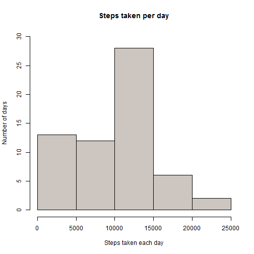
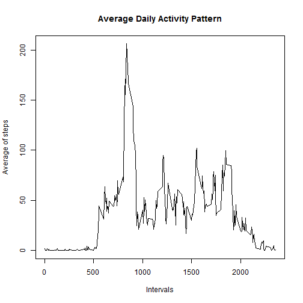
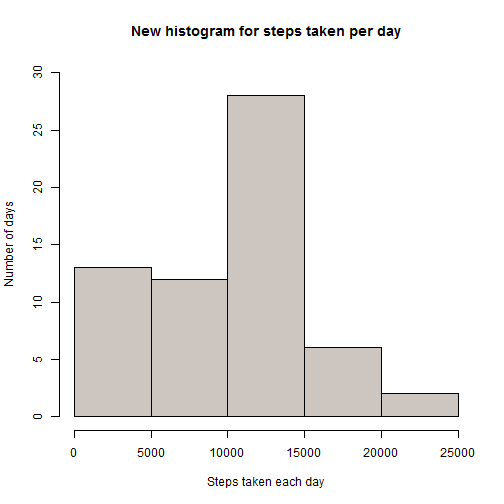
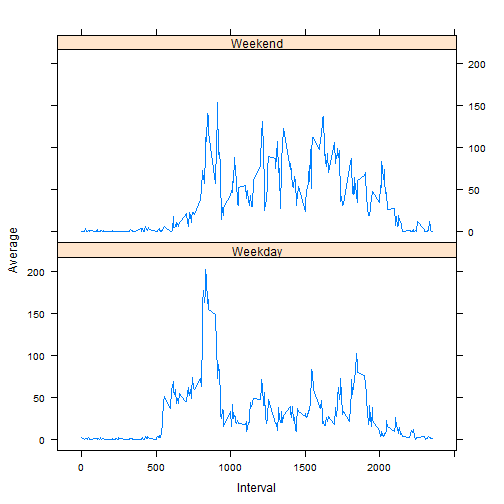

## Loading and preprocessing the data

```r
# 1. unzip and extract  extracted file to R
unzip(zipfile = "activity.zip",files = "activity.csv",exdir = ".")
dataFile <- read.csv(file = "activity.csv")
head(dataFile)
```

```
##   steps       date interval
## 1    NA 2012-10-01        0
## 2    NA 2012-10-01        5
## 3    NA 2012-10-01       10
## 4    NA 2012-10-01       15
## 5    NA 2012-10-01       20
## 6    NA 2012-10-01       25
```

## What is mean total number of steps taken per day?


```r
# Find sum of steps per day and find mean per day
steps_per_day<-tapply(X = dataFile$steps,INDEX = dataFile$date,FUN = sum,na.rm = TRUE)
hist(steps_per_day,xlab = "Steps taken each day",ylab = "Number of days",main = "Steps taken per day", ylim = c(0,30), col = "seashell3")
```

 

```r
#Mean and Median of total steps taken per day
mean(steps_per_day)
```

```
## [1] 9354.23
```

```r
median(steps_per_day)
```

```
## [1] 10395
```


## What is the average daily activity pattern?

```r
#Plot for average steps taken across all days per interval
avg_steps_per_intvl <- tapply(X = dataFile$steps, INDEX = dataFile$interval,FUN = mean, na.rm = TRUE)
intvls <- as.numeric(names(avg_steps_per_intvl))
plot(x = intvls,y = avg_steps_per_intvl,type = "l",xlab = "Intervals",ylab = "Average of steps",main = "Average Daily Activity Pattern")
```

 

```r
#5 min interval with maximum average value
max_avg <- which(avg_steps_per_intvl==max(avg_steps_per_intvl))
names(max_avg)
```

```
## [1] "835"
```

## Imputing missing values

```r
#Number of rows with missing values 
nrow(dataFile[!complete.cases(dataFile),])
```

```
## [1] 2304
```

```r
#Filling in missing values with mean of steps per day
mean_per_day <- tapply(dataFile$steps,dataFile$date,mean,na.rm=TRUE)
mean_per_day[is.nan(mean_per_day)] <- 0  
#New dataset with missing data filled in
New_dataFile <- dataFile
NA_indx <- which(is.na(New_dataFile$steps))
for(i in NA_indx)
{
  New_dataFile$steps[i] <- mean_per_day[as.character(New_dataFile$date[i])]
}
head(New_dataFile)
```

```
##   steps       date interval
## 1     0 2012-10-01        0
## 2     0 2012-10-01        5
## 3     0 2012-10-01       10
## 4     0 2012-10-01       15
## 5     0 2012-10-01       20
## 6     0 2012-10-01       25
```

```r
# New Histogram 
new_steps_per_day<-tapply(X =New_dataFile$steps,INDEX = New_dataFile$date,FUN = sum)
hist(new_steps_per_day,xlab = "Steps taken each day",ylab = "Number of days",main = "New histogram for steps taken per day", ylim = c(0,30), col = "seashell3")
```

 

```r
#Mean and Median of total steps taken per day according to New_dataFile
mean(new_steps_per_day)
```

```
## [1] 9354.23
```

```r
median(new_steps_per_day)
```

```
## [1] 10395
```
Note that the mean and median remained the same. ie, Mean and Median values for Total number of steps taken per day is unaffected when missing data is replaced by average number of steps taken that day.  
  
## Are there differences in activity patterns between weekdays and weekends?

```r
#Creating a factor with levels "Weekday" and "Weekend" in New_dataFile
wkdys_vector <- c("Monday","Tuesday","Wednesday","Thursday","Friday")
bln_wkdys <- weekdays(as.Date(New_dataFile$date)) %in% wkdys_vector
New_dataFile$weekday <-factor(bln_wkdys,levels = c(TRUE,FALSE),labels = c("Weekday","Weekend"))
head(New_dataFile)  
```

```
##   steps       date interval weekday
## 1     0 2012-10-01        0 Weekday
## 2     0 2012-10-01        5 Weekday
## 3     0 2012-10-01       10 Weekday
## 4     0 2012-10-01       15 Weekday
## 5     0 2012-10-01       20 Weekday
## 6     0 2012-10-01       25 Weekday
```

```r
# Finding the average number of steps taken across all weekdays/weekends
avg_steps_weekday <- tapply(
  X = New_dataFile$steps[New_dataFile$weekday=="Weekday"],
  INDEX = New_dataFile$interval[New_dataFile$weekday=="Weekday"], FUN = mean)
avg_steps_weekend <- tapply(
  X = New_dataFile$steps[New_dataFile$weekday=="Weekend"],
  INDEX = New_dataFile$interval[New_dataFile$weekday=="Weekend"], FUN = mean)
#Extracting data for the time series plot
avgData <- data.frame(matrix(NA,nrow = 576,ncol = 3))
colnames(avgData) <- c("Interval","Average","typ")
avgData$typ <- factor(rep(c("Weekday","Weekend"),each=288),labels = c("Weekday","Weekend"))
avgData$Average <- c(avg_steps_weekday,avg_steps_weekend)
avgData$Interval <- rep(as.numeric(names(avg_steps_weekday)),2)
avgData[283:293,]
```

```
##     Interval   Average     typ
## 283     2330 2.6888889 Weekday
## 284     2335 1.6222222 Weekday
## 285     2340 1.8000000 Weekday
## 286     2345 0.1777778 Weekday
## 287     2350 0.2666667 Weekday
## 288     2355 1.2666667 Weekday
## 289        0 0.0000000 Weekend
## 290        5 0.0000000 Weekend
## 291       10 0.0000000 Weekend
## 292       15 0.0000000 Weekend
## 293       20 0.0000000 Weekend
```

```r
#To plot- Average number of steps taken across weekends and weekdays
library(lattice)
xyplot(Average~Interval|typ,avgData,type="l",layout=c(1,2))
```

 
